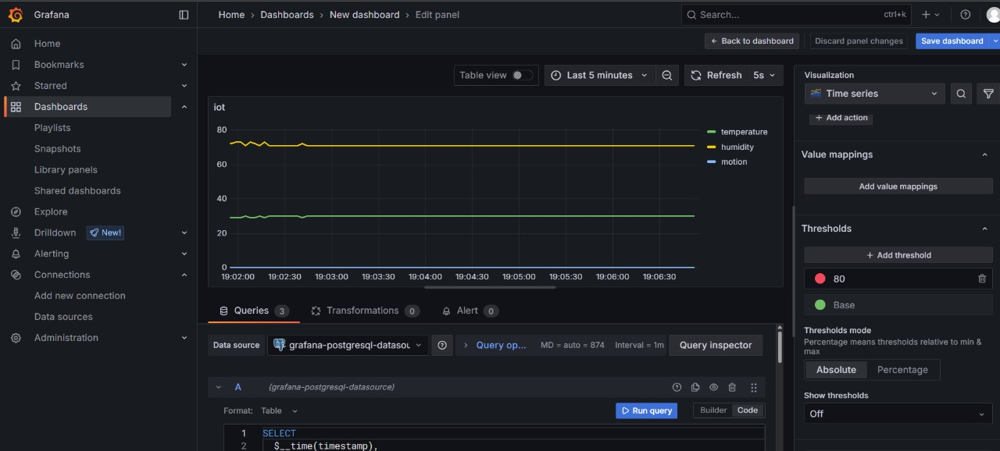

# IoT Sensor Monitoring dengan ESP8266, MQTT, TimeScaleDB, dan Grafana
[](https://github.com/Zaynorang/iot-sensor-monitoring)
[](https://github.com/Zaynorang/iot-sensor-monitoring/commits)

Proyek ini bertujuan untuk memonitor suhu, kelembaban, dan gerakan menggunakan ESP8266, sensor DHT11, dan sensor PIR. Data dikirimkan melalui MQTT ke broker HiveMQ, disimpan dalam database TimeScaleDB, dan divisualisasikan menggunakan Grafana. Semua komponen backend dijalankan dengan Docker Compose.

## 📦 Struktur Proyek
```bash
IOT-SENSOR-MONITORING/
├── docker-compose.yml # Konfigurasi Docker untuk PostgreSQL dan Grafana
├── init.sql # Skrip SQL untuk membuat tabel dan hypertable
├── kodeesp8266.ino # Program untuk ESP8266 (publish ke MQTT)
├── mqtt_to_timescaledb.py # Python subscriber MQTT dan insert ke DB
```
## 🛠️ Hardware

- ESP8266 NodeMCU
- Sensor DHT11 (suhu & kelembaban)
- Sensor PIR (gerakan)
- Kabel jumper

## 💻 Software & Tools

- Arduino IDE
- Python 3
- Paho MQTT Client (Python)
- Mosquitto MQTT client
- Docker & Docker Compose
- PostgreSQL + TimeScaleDB
- Grafana
- HiveMQ broker (free public MQTT broker)

## 🔧 Cara Kerja Sistem

1. **ESP8266** membaca data dari DHT11 dan PIR.
2. Data dikirim ke **broker MQTT (HiveMQ)**.
3. **Python script** (`mqtt_to_timescaledb.py`) berperan sebagai subscriber MQTT dan menyimpan data ke **TimeScaleDB**.
4. **Grafana** mengambil data dari TimeScaleDB dan menampilkannya sebagai grafik real-time.
5. Semua backend dijalankan menggunakan **Docker Compose**.

## 🚀 Menjalankan Proyek

### 1. Upload ke ESP8266

- Gunakan `kodeesp8266.ino` melalui Arduino IDE
- Pastikan WiFi dan MQTT broker diatur sesuai
- Jangan lupa install dulu library ESPnya

### 2. Jalankan Docker Compose

```bash
docker-compose up -d
```

### 3. Jalankan Skrip Python
Pastikan telah menginstall dependensi:

```bash
pip install paho-mqtt psycopg2
python3 mqtt_to_timescaledb.py
```


### 4. Akses Grafana
Buka http://localhost:3000
Login default: admin / admin
Tambahkan datasource PostgreSQL → buat dashboard → pilih tabel dan visualisasikan data.
#### Query untuk Temperatur
```bash
SELECT
  $__time(timestamp),
  temperature
FROM sensor_data
ORDER BY timestamp ASC

```
#### Query untuk Kelembaban
```bash
SELECT
  $__time(timestamp),
  humidity
FROM sensor_data
ORDER BY timestamp ASC

```
#### Query untuk Gerakan (Motion)
```bash
SELECT
  $__time(timestamp),
  motion::int
FROM sensor_data
ORDER BY timestamp ASC

```


## 📷 Dokumentasi Gambar
- Rangkaian
  
  

- Tampilan Grafana Web
  
  


